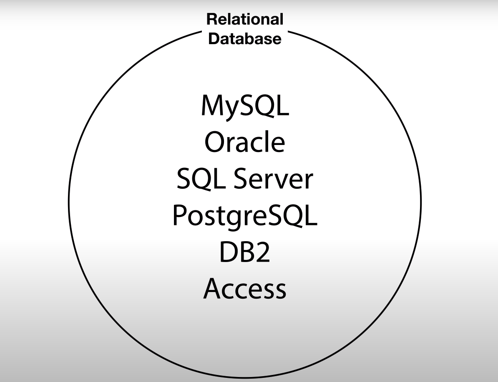

# MySQL

> 데이터베이스 시장을 장악하고 있는 절대강자인 관계형 데이터베이스 중 가격이 비싼 Oracle 대신 무료이고 오픈소스 기반인 MySQL을 데이터베이스의 시작으로 배워 보도록 하겠습니당.
>
> 데이터베이스를 다뤄봤다고 하기엔 python 기반에 오픈소스인 Django 프레임워크를 이용해 장고ORM이 전부였습니다..ㅎㅎ..
>
> 보다 간편한 명령어로 손쉽게 테이블을 만들어주던 그때도 지독하게 데이터베이스를 잘 못 다뤘습니다ㅠㅠ 
>
> key를 할당하고 관계를 연결짓는 부분이 너무 어렵더라구요...ㅎㅎㅎ
>
> 나의 단점을 알고 극복해 나가는 것도 성장의 한 방향이라고 생각하고 MySQL을 열심히 배워 보겠습니다! 🙂화이팅!
>
> 이 정보는 생활코딩 - DATABASE 수업 기반으로 만들어졌습니다.😏


## 1. 서론 

### 1.1 MySQL이란? 

인류는 오랫동안 컴퓨터를 이용해서 정보를 관리하고 싶어했고 `file`이라는 정보관리 도구를 만들어냈습니다. 

데이터베이스 조차 file에 정보를 저장합니다. 

처음엔 file만으로 만족했지만 정보가 폭발적으로 많아지고 다양해지면서 file 만으로는 정보를 입력, 저장, 수정, 삭제하는게 불편해집니다.

**즉 데이터를 잘 정리정돈해서 필요할 때 쉽게 꺼내 쓰고 싶다는 욕심이 생겨난 것 입니다.**

1960년 부터 file의 한계를 극복하기 위한 시도가 본격적으로 시작되는데 누구나 쉽게 데이터를 정리 정돈 할 수 있는 전문적인 소프트웨어를 고안해 내기 시작했고 그런 관점에서 등장한 DATABASE가 있습니다.

1970년 관계형데이터베이스(Relational database)가 등장하게 됩니다. 

2020년이 된 지금까지 관계형데이터베이스는 데이터베이스 분야에서 절대강자로 군립하고 있습니다.

- 관계형 데이터베이스의 장점 
  - 데이터를 표의 형태로 저장이 가능(like excle)
  - 정렬, 검색과 같은 작업을 빠르고 편리하고 안전하게 할 수 있다. 




WEB이 폭발적인 성장을 하면서 웹개발자들은 웹페이지를 통해서 표현할 정보를 저장할 데이터 베이스를 찾게 됩니다.

무료이면서 오픈소스였던 MySQL은 좋은 대안이 됩니다. 


따라서 MySQL은 WEB개발과 함께 폭발적으로 성장하게 됩니다. 

우리가 모르는 사이에 MySQL 서비스를 사용한 WEB을 사용했을 것입니다.😁


### 1.2 데이터베이스의 목적

> 사실 목적없이 남들이 쓰니까 무작정 따라 쓴다? 처럼 무서운 생각이 없는 것 같습니다. 
>
> 서비스를 이용할 때 무엇보다도 내가 왜 이 서비스를 이용해야 하는지 당위성을 따져 보라고 하셨던 코딩쌤의 가르침이 생각이 나네용😚
>
> 왜 데이터베이스를 사용해야하는지 정리해 보겠습니다. 

#### Excle(spreadsheet) vs DATABASE 


- 공통점 
  - 관계형 데이터 베이스는 엑셀과 같이 데이터를 표의 형태로 표현해 줌 
  - 따라서 둘의 기능이 거의 비슷함 
- 차이점
  - 데이터베이스는 코드(컴퓨터언어)로 명령을 내려 원하는 값을 받아낸다.
    - 즉, 문법이 존재
  - 엑셀은 클릭으로 명령을 입력 받음(GUI 제공받음)


이렇게 받아온 데이터를 공유, 저장 할 수 있음

그렇다라는 것은 다양한 분야에 응용이 가능하다는 것을 뜻합니다. 

예를 들어 웹페이지, 앱 어플리케이션, 인공지능을 이용한 분석, 클라우드 등등 


웹과 양방향으로 작동되는 데이터베이스를 통해 느낄 수 있는 점 


데이터베이스를 내부적으로 중요한 부품으로 사용하는 수많은 사례중에 하나, 웹사이트의 정보를 데이터베이스에 담을 때, 두 가지의 기술을 결합하면 

1. 데이터베이스의 정보를 전세계 누구나 이 웹사이트에 접속하면 볼 수 있다는 것 
2. 전세계 누구나 이 웹사이트에 글을 쓰면 우리가 직접 데이터베이스를 제어하도록 하지 않아도 글을 써서 데이터베이스에 저장 할 수 있다는 것 


내부 메커니즘을 궁금해 하는 것 보다 사용하는 방법에 초점을 두는 것이 지금 단계로는 적합한 것 같습니다😅


### 1.3 MySQL 설치

#### ☝🏻notice! 

만약 MySQL을 설치하다가 에러가 나거나 피치못할 사정으로 프로그램이 설치되지 않는다면 

[다양한 언어들을 웹사이트에서 실행시켜보기](https://codeanywhere.com/)

위의 링크로 들어가서 생활코딩의 실습 코드를 따라 쳐봅시다!! 

(이미 gmail아이디로 회원가입을 했으니 혹여나 파일이 실행이 안된다면 위의 링크를 들어가 해봅시당!😎)


컴퓨터를 껐다 켰을 때, manager-windows를 열어서 MySQL이 활성화가 되어있다면 환경설정이 다 된것이라고 보시면 되구 MySQL에 빨간불이 켜져 있다면 start 버튼을 눌러 활성화 시켜 줘야 합니다! 


MySQL을 실행해 실습을 같이 따라가려면 `저 파일(mysql.exe)`을 터미널에서 실행 시켜야합니다. 


원하는 경로에서 `cmd .`이라고 입력하고 엔터를 누르면 그 경로에서 터미널창이 열리는 것을 알 수 있습니다.  


명령어를 입력해 파일을 실행시킵니다.

```sql
mysql -uroot -p
```

MySQL설치 때 사용했던 `root비밀번호`를 입력해야 합니다.

(힌트 : 항상 쓰는 비밀번호에서 특수문자 대신 사용해야 번호가 들어갑니다🙄)


`Welcome to the MySQL monitor` 라고 뜨면 성공적으로 MySQL을 실행 시킨겁니다😊

`>mysql`로 시작되는 부분에 sql 코드를 따라 입력하면 됩니다!


## 2. MySQL 기본

> 이제 본격적으로 들어가 보도록 하겠습니다ㅎㅎ 화이팅입니다.😁

### 2.1 MySQL의 구조 

전체적으로 어떻게 구성되어 있는지 살펴보는 부분입니다. 데이터 베이스를 구성하는 요소는 대략 3가지 정도가 있습니다.

우리가 데이터를 기록하는 최종적인 곳은 `표(table)`입니다. 

관계형 데이터 베이스는 엑셀과 같은 spreadsheet와 비슷한 구조를 가지고 있습니다.

결국엔 `표(table)`에 저장됩니다.

글들을 저장하는 표, 댓글을 저장하는 표, 회원정보를 저장하는 표 등등........

여기서 나타나는 문제점은 많아진 표들을 잘 정리정돈할 필요성이 생깁니다.

마치 `file`에서 디렉토리의 필요성이 대두되는 것처럼 말입니다.


그래서 **MySQL에서는 연관된 표들을 그룹핑(grouping)해서 연관되어있지 않은 표들과 분리하는데 사용하는 file에서 폴더(directory)와 같은 역할을 하는 `데이터베이스(database)`**가 있습니다. 

MySQL에서는 데이터베이스라는 말과 함께 `스키마(schema)`라는 단어로도 통합니다. 

**따라서 스키마는 연관된 데이터인 표들을 서로 그룹핑 할 떄 사용하는 일종의 폴더(directory)**라고 생각합시다. 


스키마(schema)들이 많아지면 이것들을 또 저장할 공간이 필요합니다. 

그것을 `데이터베이스 서버(database server)`라고 합니다. 


MySQL을 설치했다는 것은 데이터베이스 서버라는 프로그램을 설치한 것이고 그 프로그램이 가지고 있는 기능성을 이용해서 데이터와 관련된 여러가지 작업을 하는 겁니다. 


### 2.2 MySQL 서버접속 

> 데이터베이스 서버 사용방법에 대해 알아보겠습니다.😎


데이터베이스를 사용했을 때 장점은 `보안`입니다.

데이터베이스는 자체적인 보안 체계를 가지고 있기 때문에 보다 안전하게 데이터를 보관할 수 있습니다. 

그 외에 권한 기능이 있어 MySQL에 여러 사람을 등록해 두고 `접근 권한`을 줄 수 있습니다. 


- 서버접속
  - -u : user 
  - root : root라는 사용자로 접속하겠다.(관리자 권한) 
  - -p : password입력 
    - 만약에 비밀번호를 잃어버렸다면 구글에 `mysql password forgot`이라고 구글링해보면 다 나옵니당ㅎㅎ

```sql
mysql> mysql -uroot -p
```


이렇게 해서 우리는 데이터베이스 서버(database server)를 넘어선 것이라고 말할 수 있습니다. 


### 2.3 MySQL 스키마의 사용 

> 물론 강사 선생님이 가르쳐 주시면 좋지만 더 좋은 구선생님이 있습니다.😎
>
> 구선생님이 다양한 검색 결과를 보여줄 테지만 최대한 `doc`서버를 참고해서 서비스를 이용하는 것이 가장 정확합니다. 
>
> 따라서 아래의 명령어들을 외울 필요 없습니다. 그 때, 그 때 필요할 때 검색엔진을 통해 검색하면 금방 알아낼 수 있습니다.🤩


#### ☝🏻notice

sql 문법은 파이썬과는 다르게 `;`으로 명령어 단위를 구분합니다.

따라서 명령어 입력이 끝났다는 것을 가르쳐 주기 위해선 반드시 `;`을 코드 뒤에 붙여 주셔야 합니다. 


- 데이터베이스(스키마) 생성 

```sql
mysql> CREATE DATABASE 데이터베이스이름;
```


- 데이터베이스(스키마) 삭제

```sql
mysql> DROP DATABASE 데이터베이스이름;
```


- 데이터베이스(스키마) 생성 확인 
  - 여기서 검색 TIP👩🏻‍🏫
  - 아무래도 영어로 검색하는 편이 훨씬 많은 정보를 정확하게 얻을 수 있습니다.
  - `How to show database in my sql`
  - 이런식으로 검색하면 금방 원하는 명령어들을 얻을 수 있습니다.

```sql
mysql> SHOW DATABASE;
```


데이터베이스를 생성했으면 저 안에 표(table)를 만들어야 합니다. 

✨중요한 건 작업 장소가 저 데이터베이스 안이라는 겁니다! 

데이터베이스를 사용하겠다는 것을 MySQL에 알려줘야합니다.


- 데이터베이스 사용 명령어

```sql
mysql> USE 데이터베이스이름;
```


### 2.4 SQL과 테이블의 구조 

> 이제 드디어 표를 다룰 준비가 됐습니다! 
>
> 단계를 많이 거쳐서 들어가야하지만 데이터가 아주 많은 상황에서 써야하는 상황이기에 이해하고 넘어가보도록 합시당 


SQL 은 프로그래밍 언어입니다! 

- Structured : 표를 작성하여 정리정돈 하는 것 -> 정리된
- Query : 데이터베이스에게 정보를 요청한다라는 뜻에서 사용됩니다.
- Language : 데이터베이스도 이해할 수 있고 사용자도 이해할 수 있는 문법을 사용해야합니다. 


#### sql은 쉽지만 중요합니다!

관계형 데이터베이스라는 카테고리에 속하는 제품들이 공통적으로 데이터베이스 서버를 제어할 때 사용되는 표준화 된 언어입니다. 

압도적인 다수의 데이터베이스 시스템이 sql을 통해서 동작하고 sql이라는 것에 의해서 수많은 정보 서비스를 접하고 있다는 것 입니다. 

한마디로 가성비가 아주 뛰어난 컴퓨터 언어입니다! 


#### ☝🏻여기서 용어 정리! 

- row (행, x축, 수평)
  - `MySQL`, `Oracle`이라는 두 개의 행이 존재 
  - ✍🏻그 말은 `데이터가 2건 있다`는 뜻이기도 하다

- colum(열, y축, 수직)
  - `id`, `title`, `description`, `created`  이라는 4개의 열이 존재
  - ✍🏻데이터의 타입


## 3. MySQL 테이블의 생성 

