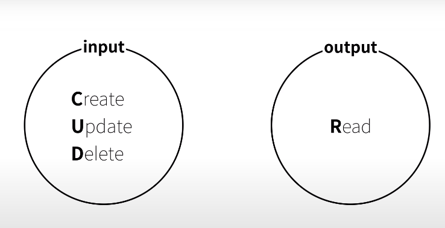
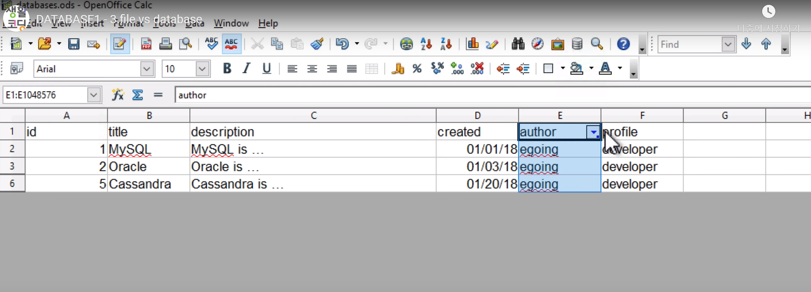
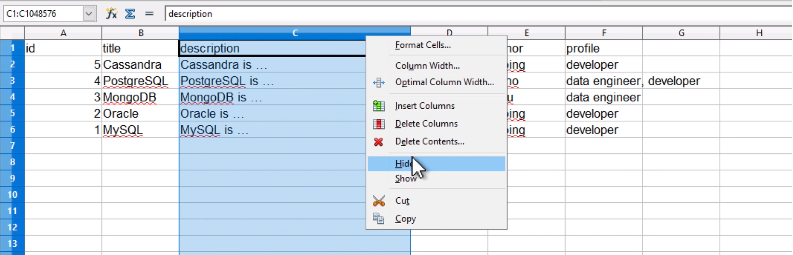
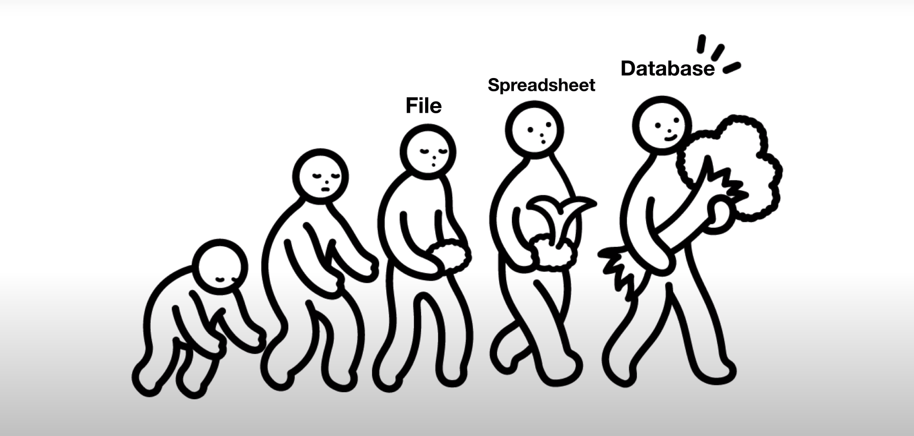
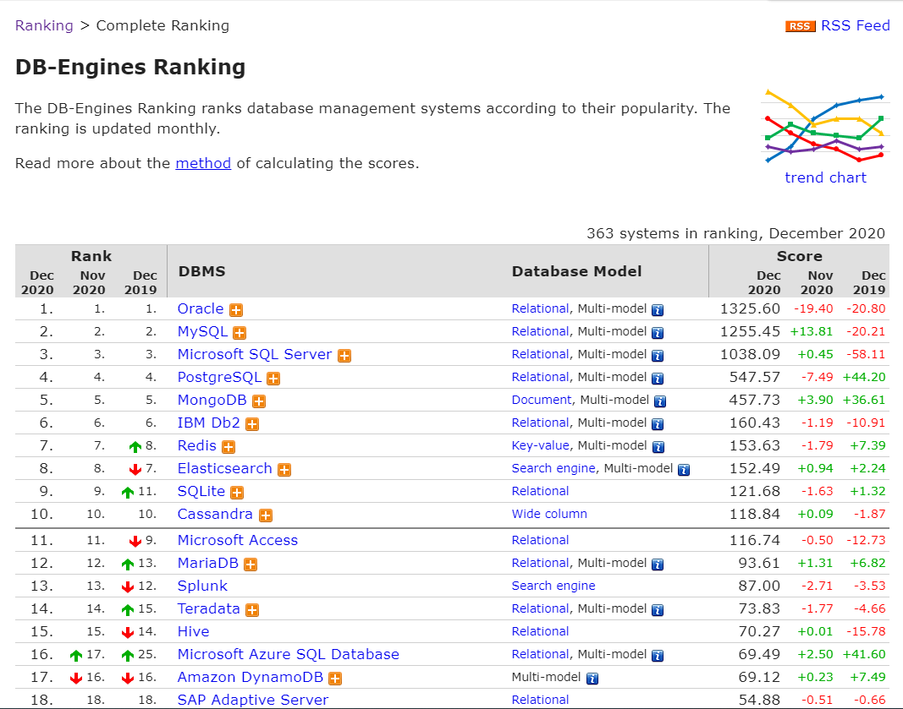

# DATABASE

> 대학시절 필수 전공이 아니었던 데이터베이스를 안들어서 그런건지..
>
> 프로그래밍에서 필수인 데이터베이스가 아무리 봐도봐도 익숙해지지 않습니다ㅠㅠ..
>
> 특히 테이블을 연결하는 관계가 익숙치 않고 거기에 따른 키(key)분배의 어려움으로 강의를 듣게 됐습니다. 
>
> 생활코딩 - DATABASE 수업을 바탕으로 내용을 정리 하겠습니다! 🙂

## 1. DATABASE 소개 및 본질 알아보기 

### 1.1 데이터가 중요한 이유 

데이터를 이용해서 다양한 일을 할 수 있습니다.

예를들어 인터넷에 연결된 앱과 웹을 통해 소식과 정보를 전달할 뿐만 아니라 인공지능과 같은 기술을 이용해서 대규모 데이터의 통찰력 있는 결과를 뽑아 낼 수도 있습니다.

어찌됐건 중요하다는 건 너무 잘 알겠습니다 ㅎㅎ

이런 일을 하기 위해서는 데이터를 저장하고 꺼낼 수 있어야합니다.

 

file을 대표적인 예로 들 수 있습니다. 

- 장점 
  - 어디서든 사용 가능 
  - 간편하게 email로 전송도 가능 

- 단점 
  - 성능, 보안, 편의성에 한계를 가지고 있음 

이런 file의 단점을 보완하기 위해 나온 데이터를 위한 전문화 된 소프트웨어가 `데이터베이스` 입니다.

이렇게 데이터를 간편하고 고성능으로 보안까지 지켜주는 데이터베이스 소프트웨어가 세상에 많이 존재합니다.

대표적으로 `mySQL`, `Oracle`, `postgreSQL`, `SQL Server` , `MongoDB` 등등 다양한 소프트웨어들이 있습니다. 

#### 데이터베이스를 잘 이해하기 위해서는 상상력을 가지고 있어야 합니다. 

데이터베이스는 거대하고 복잡하고 위험한 데이터를 다루기 위해서 고안된 도구입니다. 

데이터베이스는 그만큼 복잡합니다. 

대체로 이런 문제에 직면할 기회가 없기 떄문에 데이터 베이스가 어렵고 복잡하고 뜬구름 잡는 소리 처럼 느껴질 수도 있습니다.

다행스럽게 우리에겐 상상력이 있으니까 우리가 가지고 있는 문제를 크고 어렵고 복잡하다고 생각하면 됩니다. 

공감이 없는 이해는 모래위에 지어진 성일 뿐입니다! 

### 1.2 데이터베이스의 본질 

제일 먼저 해야할 것은 데이터 베이스에 데이터를 어떻게 입력하고 어떻게 출력할 건지를 따져보는게 아주 중요하다.

출처 : 생활코딩 - DATABASE 1

### 1.3 file vs spreadsheet vs database 

- spreadsheet

  - 장점 

    - 원하는 조건을 기준(날짜, 작성자.....)으로 빠르게 정보를 분류 할 수 있다. 
    - 출처 : 생활 코딩 

    

    - 보고 싶지 않은 영역은 감추는 것도 가능
    - 출처 : 생활 코딩

    

  - 즉, 데이터 가공이 file보다 spreadsheet가 훨씬 쉬워진다. 

  

  

 

spreadsheet와 database의 차이점은 무엇인가?

프로그래밍적으로 또는 컴퓨터 언어를 이용해서 데이터를 추가하고 수정하고 삭제하고 읽을 수 있는 것을 전문적인 데이터베이스 소프트웨어는 가지고 있다. 

그것이  갖는 장점은, **자동화**할  수 있다는 것입니다.

사람이 일일이 작성하지 않아도 어떤 조건에 따라 자동으로 데이터를 생성하고 수정하고 작성하고 삭제하고 읽을 수 있다는 것이 가장 중요한 장점이라고 할 수 있습니다! 

Q ) database를 그럼 어떤 프로그램을 사용해야 할까요? 어떤 데이터베이스 프로그램이 좋을까요?

​	`database ranking 2020`으로 검색해서 나오는 `DB-Engines Ranking` 을 참고 

- database Model 
  - 어떤 형식의 데이터베이스 인가를 제공 
    - Relatinal DBMS : 관계형 데이터 베이스 관리 시스템, 역사적으로 오래된 데이터베이스 형식 
      - 전체적인 데이터베이스 시장 흐름을 장악하고 있는것은 관계형 데이터 베이스인 것을 알 수 있다.
    - Document store :  

간단하게 정리하는 각 데이터베이스 규모와 사용처

- Oracle  
  - 관공서나 기업에서 많이 사용, 
  - 가격이 적게는 천만원부터 시작(고가이다.)
  - 데이터의 기술 지원의 컨설팅 비용이 비싸다. 자급력이 필요 
- MySQL 
  - 무료, 오픈소스
  - 관계형 데이터베이스를 이용하면서 자금이 없고 작은회사, sns와 같이 대규모의 데이터이지만 신뢰성은 중요하지 않은 기업에서는 좋은 서비스라고 할 수 있다. 
- MongoDB  
  -  관계형 데이터베이스가 아님
  -  사물인터넷, sns등의 출현으로 다양한 종류의 데이터들이 등장, 관계형 데이터베이스가 아닌 다양한 데이터베이스가 성장하고 있는 흐름에 적합 